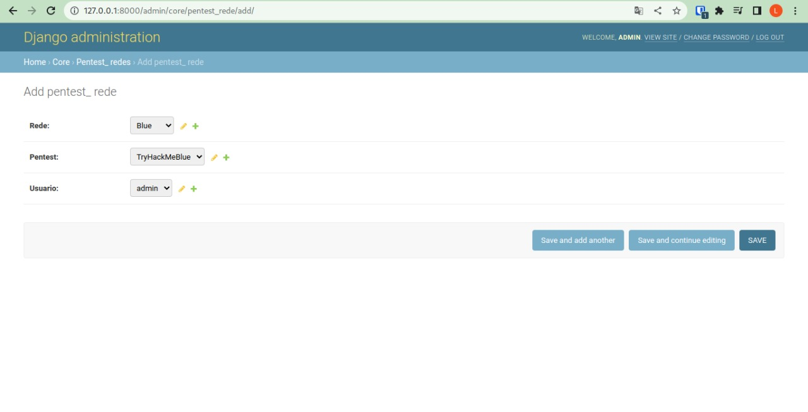
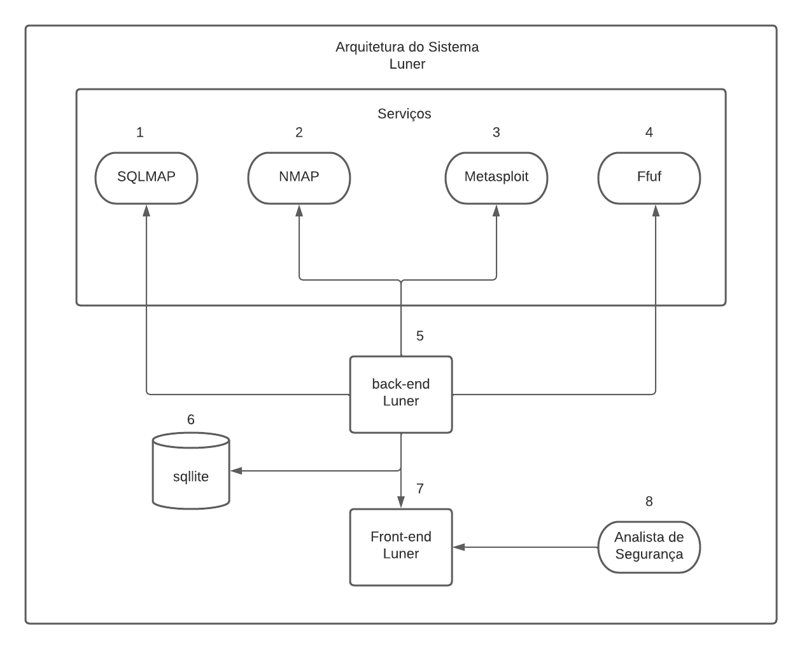

# Luner : um mecanismo para detecção de vulnerabilidades em serviços de rede}
## O aplicativo para pentesters

Hey, o luner é uma aplicação web feita em Python (Django), para automatizar processos
do pentest, integrado com o Metasploit, Nmap, ffuf e entre outras ferramentas de pentest.


## Objetivos
A aplicação Luner tem como objetivo automatizar o processo de pentest

## Artigo

Está no link do Drive: https://drive.google.com/file/d/1OVfwFcYgoPxUyj6H9uVLmtna67ZRtn9n/view?usp=sharing
[Intro.pdf](https://github.com/LUCASRENAA/Luner/tree/dev/static/apresentacao_git/LunerArtigo.pdf).


# Requisitos do sistema
- [x] Tela inicial
- [x] Mostrar os ips e portas encontradas
- [x] Integrar com o metaexploit
- [x] WEBSHELL
- [x] Exibir os diretorios encontrados através do ffuf
- [x] Mostrar de alguma forma na tela de enumeração os ips mais vulneraveis
- [x] Criar tela de exploração
- [x] Criar tela de documentação
- [x] Definir os query parameters
- [x] Verificar os query parameters e testar se são vulneraveis a sql injection com sqlmap
- [ ] Criar automação para achar mais diretorios e explorar sql injection

# Requisitos para rodar o sistema

Minha sugestão, rode a aplicação no Kali Linux


<h1>Como instalar?</h1>

Ainda em desenvolvimento


## Prova de conceito

O primeiro video é o de configuração  e o segundo video é da exploração da máquina Blue do TryHackMe.

Você pode acessar a sala atraveś desse link aqui:
https://tryhackme.com/room/blue

Você também pode assistir os videos caso precise
```sh
https://drive.google.com/file/d/19tHDc_8zIyw1g3qHjflUmDWqY2hQqlRJ/view?usp=sharing
https://drive.google.com/file/d/1LVWx4ILagcq-V6haKpAXiRJFFvOl41OT/view?usp=sharing

```

## Configuração do Sistema

Criar um objeto chamado Pentest_Rede

Na URL:
http://127.0.0.1:8000/admin/core/pentest_rede/add/

Como feito na próxima figura



## Invadindo um sistema

Ainda em desenvolvimento

### Primeiro acesso

```
git clone https://github.com/LUCASRENAA/Luner.git
cd Luner
echo "export SECRET_KEY='$(openssl rand -hex 40)'" > .DJANGO_SECRET_KEY
source .DJANGO_SECRET_KEY
sudo apt-get install libpq-dev python3-dev
sudo pip install psycopg2
pip3 install -r requirements.txt 
python3 manage.py migrate
python3 manage.py createsuperuser 
python3 manage.py runserver
```


## Visualização da Arquitetura Luner


## Visualização dos casos de uso do Luner


## Historia
Criei a ideia do Luner lá para abril de 2021, quando criei alguns scripts automatizados para a realização do curso da 
desec, esses scripts automatizados vocês podem ver aqui https://github.com/LUCASRENAA/NanerPentest, e depois foi se 
construindo a ideia do Luner, onde existiria uma aplicação de forma fácil automatizar processos do pentest.

No inicio as automações eram voltadas para o processo de enumeração e buscar informações, como busca de e-mails e de IPS.

E logo depois, surgiu a ideia de juntar esses scripts em python em um sistema web que em tese seria mais fácil para
manipulação e de fácil usabilidade por parte do usuário. E assim surgiu o Luner.

## Problemas

A criação do Luner foi um pouco díficil no incio, por falta de habilidade técnica no front, e não consegui trazer aquela
usabilidade que desejava no inicio do projeto. Também relacionada a clean code, muito código do sistema pode ser limpo e
melhorado.

Para realizar os scans de forma em background, optei por deixar o processo seguir em background através do & no fim do comando
mas ainda não sei se foi a melhor opção, e verificar se o scan realizou ou não através de um middleware, e para ler o arquivo
tive que criar um script de leitura de xml que a base foi essa aqui https://github.com/LUCASRENAA/lerXmlNmap


## Trabalhos futuros

Pretendo criar botões de automatizações com funcionalidades bem especificas, como procurar pro bancos no scan, e uma opção bem
geral que ao clicar, será realizado a enumeração automaticamente e a tentativa de exploração através do metasploit automaticamente

Melhoria do front também seria uma boa.

Subir o ambiente numa imagem docker facilitaria o processo de instalação da ferramenta


Ainda em desenvolvimento


## License

MIT

**Free Software**