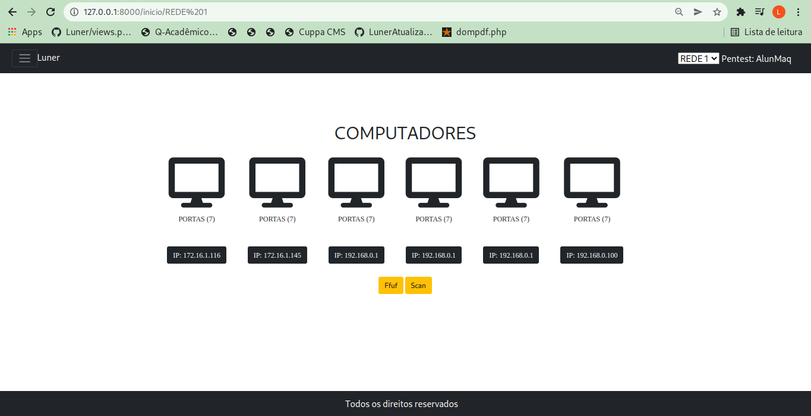
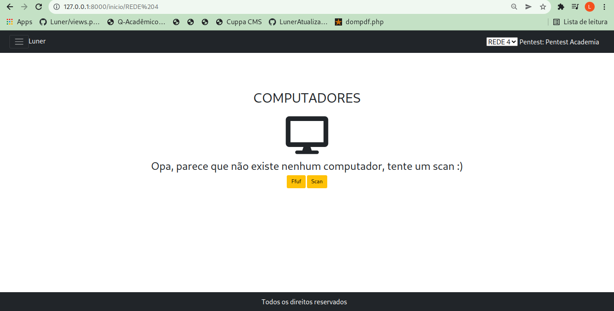
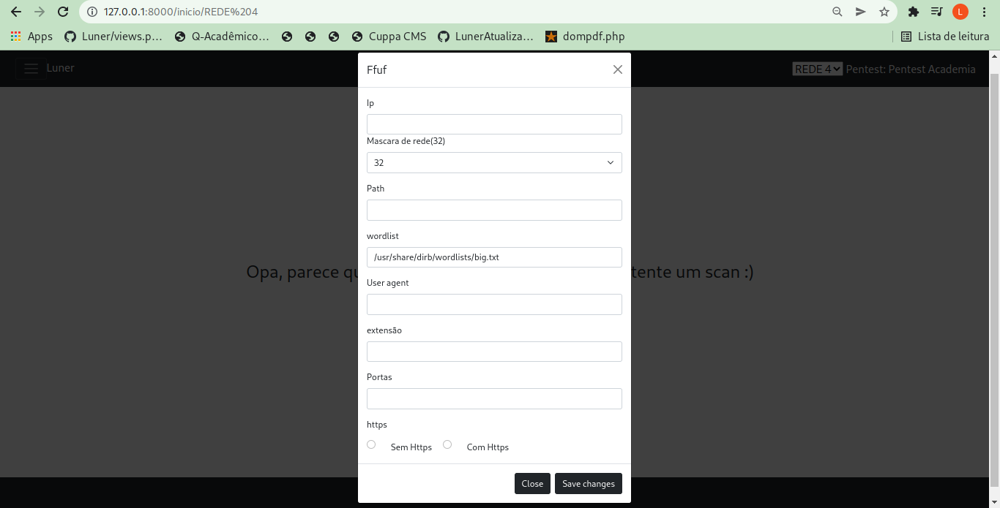
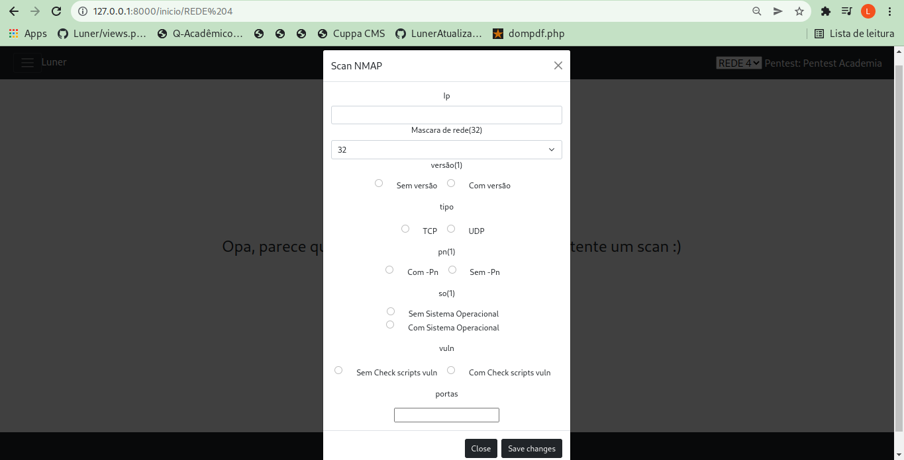
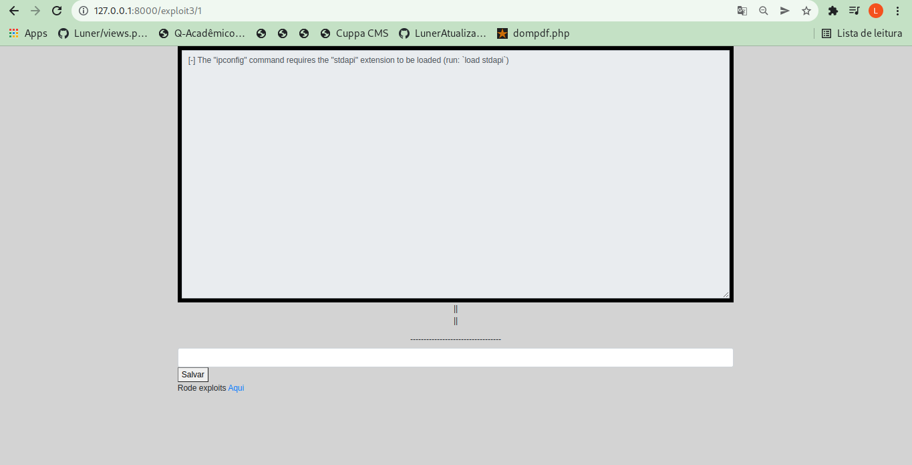

# Luner
## O aplicativo para pentesters

Hey, o luner é uma aplicação web feita em Python (Django), para automatizar processos
do pentest, integrado com o metaexploit, nmap, ffuf e entre outras ferramentas de pentest.

# Requisitos
- [x] Tela inicial
- [x] Mostrar os ips e portas encontradas
- [x] Integrar com o metaexploit
- [x] WEBSHELL
- [ ] Exibir os diretorios encontrados através do ffuf
- [ ] Mostrar de alguma forma na tela de enumeração os ips mais vulneraveis
- [ ] Criar tela de exploração
- [ ] Criar tela de documentação
- [x] Definir os query parameters
- [ ] Verificar os query parameters e testar se são vulneraveis a sql injection com sqlmap

## Tela inicial, onde vai ser exibidos os ips e as portas abertas (Talvez vou colocar os diretorios aqui também)

### Form do nmap e do ffuf

## Tela exploração (Web shell)

<h1>Como instalar?</h1>

## Como usar?

Ainda em desenvolvimento
