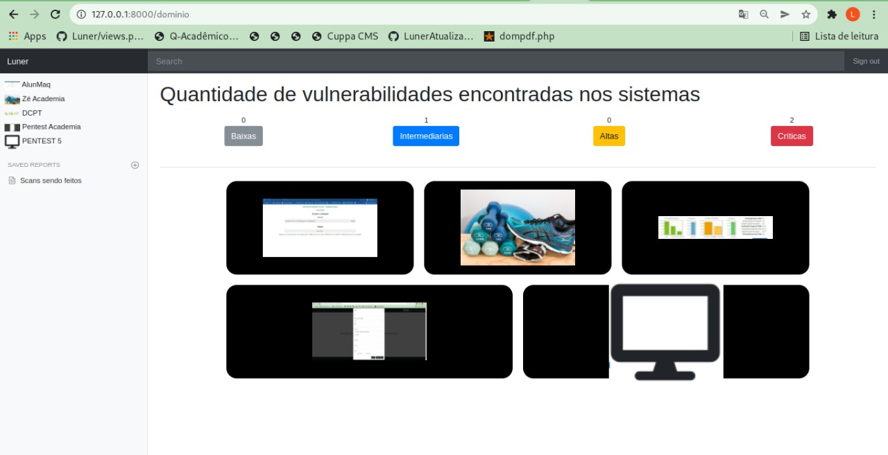
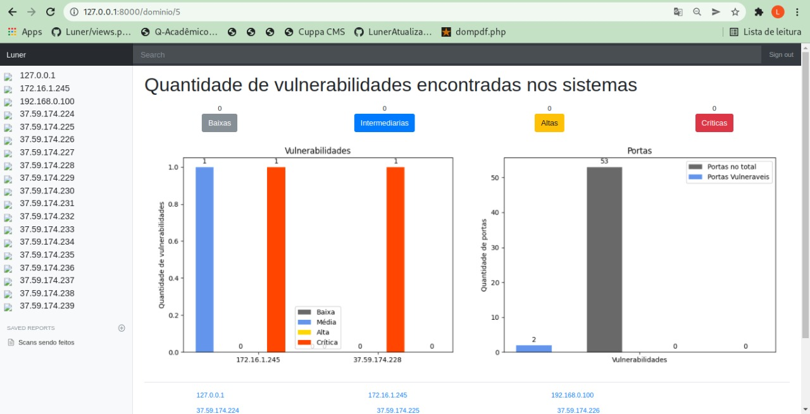
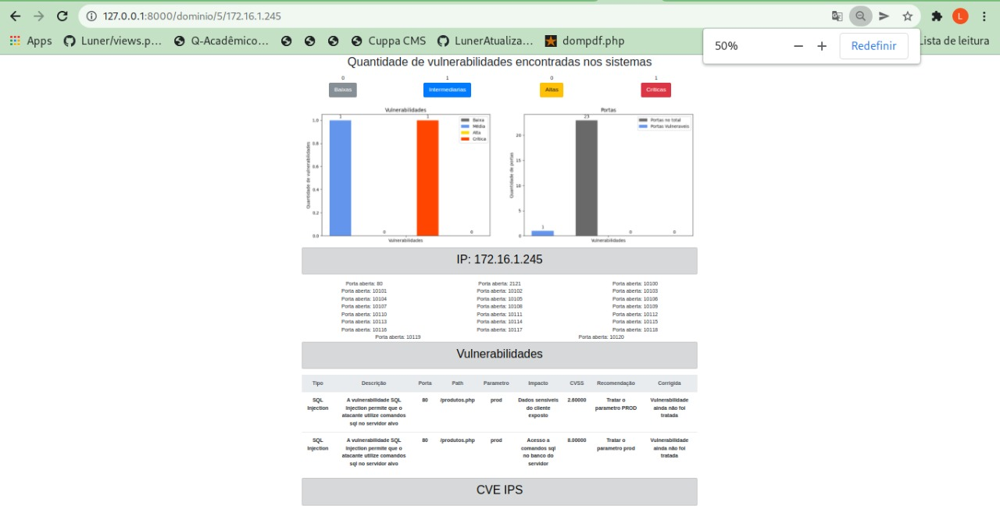
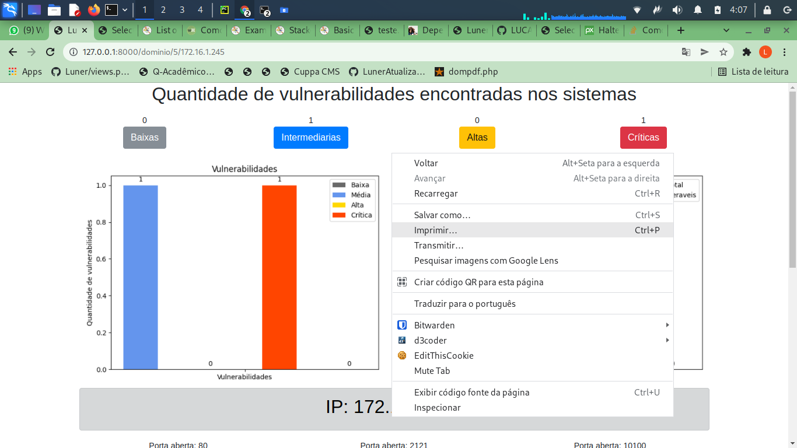
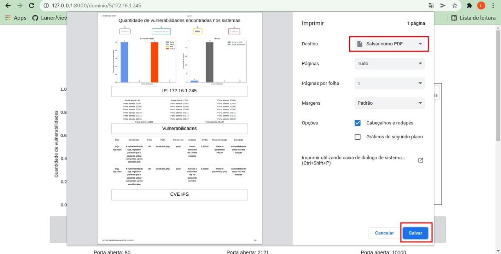

# Luner
## O aplicativo para pentesters

Hey, o luner é uma aplicação web feita em Python (Django), para automatizar processos
do pentest, integrado com o metaexploit, nmap, ffuf e entre outras ferramentas de pentest.

# Requisitos
- [x] Tela inicial
- [x] Mostrar os ips e portas encontradas
- [x] Integrar com o metaexploit
- [x] WEBSHELL
- [x] Exibir os diretorios encontrados através do ffuf
- [x] Mostrar de alguma forma na tela de enumeração os ips mais vulneraveis
- [x] Criar tela de exploração
- [x] Criar tela de documentação
- [x] Definir os query parameters
- [x] Verificar os query parameters e testar se são vulneraveis a sql injection com sqlmap
- [ ] Criar automação para achar mais diretorios e explorar sql injection

## Tela inicial, onde vai ser exibidos os ips e as portas abertas (Talvez vou colocar os diretorios aqui também)


### Form do nmap e do ffuf


## Tela exploração (Web shell)


# Tela de Documentação

## Todas as redes


## Todos os ip de uma rede


## Somente 1 ip


## Observações
Você pode desejar salvar o relatório de 1 ip como pdf, temos um exemplo em /static/apresentacao_git/ip_172_16_1_245.pdf

### Para salvar como pdf clique em imprimir


### E depois em clicar em salvar como pdf



<h1>Como instalar?</h1>

Ainda em desenvolvimento


## Como usar?

### Primeiro acesso

```
sudo apt-get install libpq-dev python3-dev
sudo pip install psycopg2
pip3 install -r requirements.txt 
python3 manage.py migrate
python3 manage.py createsuperuser 
```


Ainda em desenvolvimento
